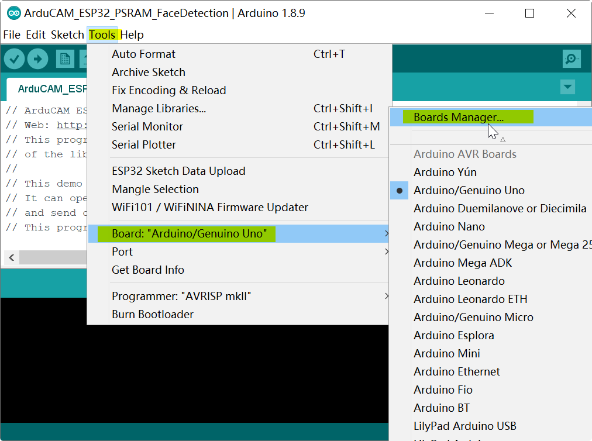
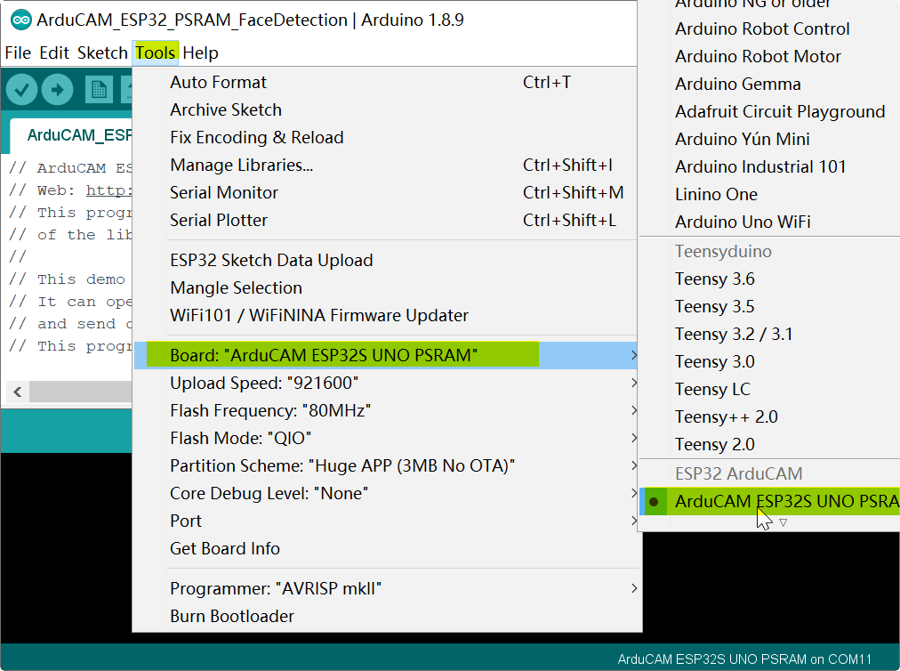
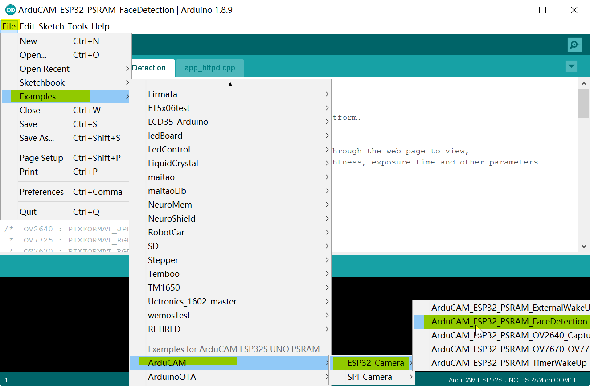
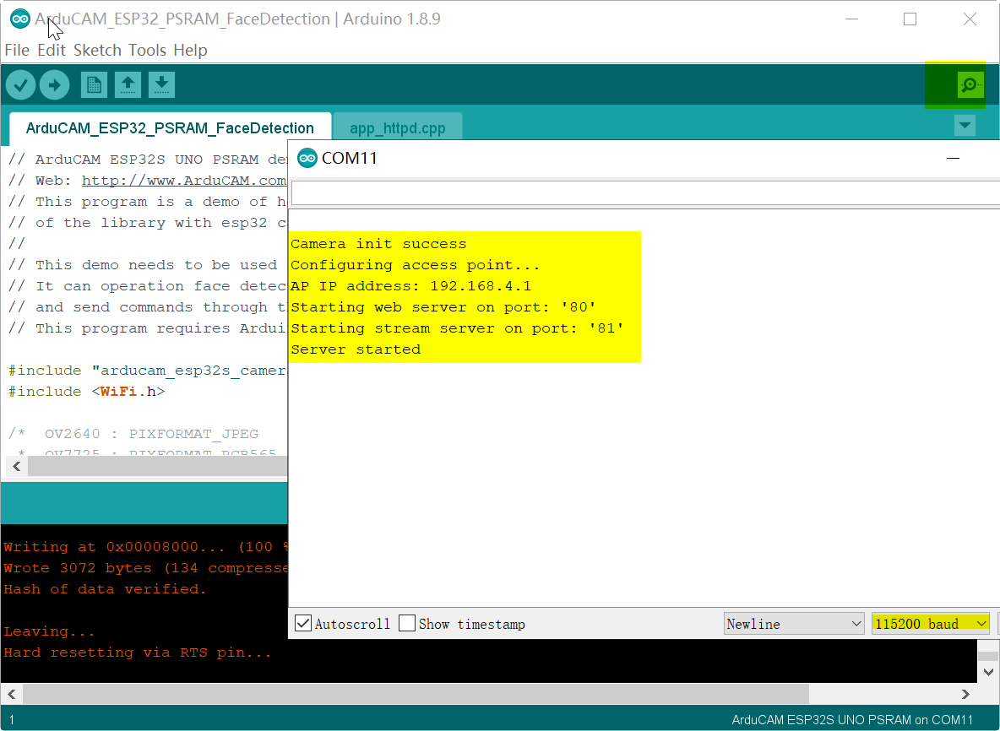
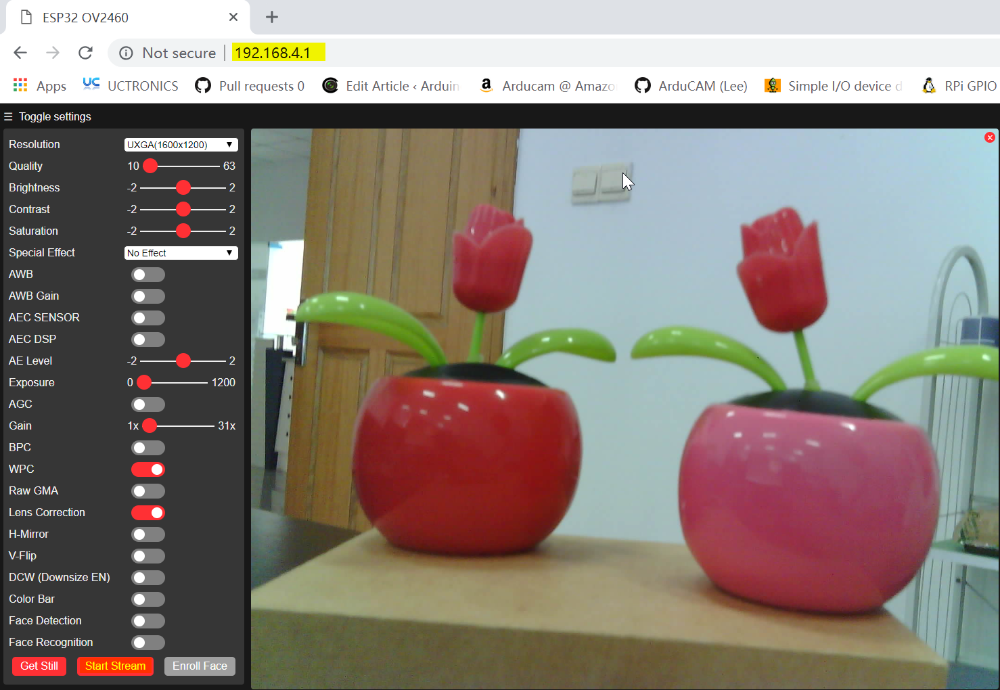

# ArduCAM_ESP32S_UNO_PSRAM

## Development Status
Most of the framework is implemented. Most noticeable is the missing analogWrite. While analogWrite is on it's way, there are a few other options that you can use:
- 16 channels [LEDC](cores/esp32/esp32-hal-ledc.h) which is PWM
- 8 channels [SigmaDelta](cores/esp32/esp32-hal-sigmadelta.h) which uses SigmaDelta modulation
- 2 channels [DAC](cores/esp32/esp32-hal-dac.h) which gives real analog output

## ArduCAM_ESP32S_UNO_PSRAM Board PINMAP


## Installation Instructions
Installation instructions using Arduino IDE Boards Manager
==========================================================
Starting with 1.6.4, Arduino allows installation of third-party platform packages using Boards Manager. We have packages available for Windows, Mac OS, and Linux (32 and 64 bit).

- Install the current upstream Arduino IDE at the 1.8 level or later. The current version is at the [Arduino website](http://www.arduino.cc/en/main/software).
- Start Arduino and open Preferences window.

- Enter ```https://www.arducam.com/downloads/esp32_uno_psram/package_ArduCAM_ESP32_PSRAM_index.json``` into *Additional Board Manager URLs* field. You can add multiple URLs, separating them with commas.

- Open Boards Manager from Tools > Board menu and install *esp32* platform (and don't forget to select your ESP32 board from Tools > Board menu after installation).



## Quickly run the demo 
- Choose the ArduCAM_ESP32S_UNO_PSRAM board.

- Choose the right port.

- Choose one example.

- Compile and upload the demo.

- Open the serial port to check the debug message.

- Connect the arducam esp32s camera hotspot and test the demo 

##Demo Test
 
#### Issue/Bug report template
Before reporting an issue, make sure you've searched for similar one that was already created. Also make sure to go through all the issues labelled as [for reference](https://github.com/espressif/arduino-esp32/issues?utf8=%E2%9C%93&q=is%3Aissue%20label%3A%22for%20reference%22%20).

Finally, if you're sure no one else had the issue, follow the [ISSUE_TEMPLATE](docs/ISSUE_TEMPLATE.md) while reporting any issue.

## Hint

Sometimes to program ESP32 via serial you must keep GPIO0 LOW during the programming process
